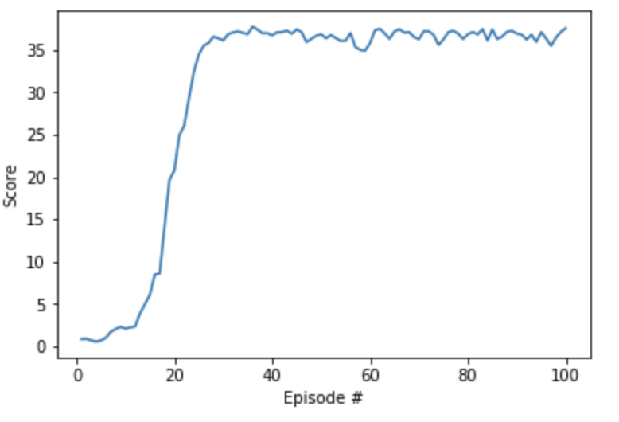

## DRL - DDPG Algorithm - Reacher Continuous Control

### Model Architecture
The Udacity provided DDPG code in PyTorch was used and adapted for this 20 agent (version 2) environment.

I used two deep neural networks (actor-critic), each with two hidden layers of 256-128 nodes, with ReLU activation functions on the hidden layers and tanh on the output layers. As discussed in the Readme overview, I used shallower DNNs than the DDPG paper. This produced superior performance compared to Udacity's baseline attempt.

### Hyperparameters
A learning rate of 1e-4 on each DNN and batch size of 128 were used along with replay buffer size of 1e5, gamma .99 and Tau of 1e-3. There was no change to the default Ornstein-Uhlenbeck noise parameters (0.15 theta and 0.2 sigma.)

## Results and Future Work

The model was able to achieve the 30 average reward goal in the least possible amount of time - <strong>just 100 episodes</strong>.

I did experiment with tuning other hyperparameters, but they did not have the same positive impact as hidden layer node reduction and learning rate changes described above. Having said that, I believe that adjustments to the Ornstein-Uhlenbeck noise level, which controls the amount of exploration the agent does, could yield improved results in some environments. Decaying the noise level (exploration) over time is regularly done in other deep reinforcement learning algorithms. However, since my model had already achieve maximum performance for this task, there was no need to explore it further.

I plan to now do the optional Crawler exercise, which is much more complex with a 20 action space and 129 state space to see how I can further improve on the baseline DDPG algorithm.
